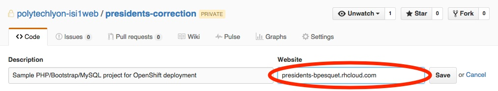

## Exigences métier

L'objectif de ce projet est de réaliser une application Web de type « e-commerce », avec ses fonctionnalités classiques :

* Affichage d'une liste de produits par catégorie.
* Détails sur un produit.
* Connexion et inscription utilisateur.
* Back-office d'administration.
* Ajout au panier.

Un exemple de résultat est [disponible en ligne](http://oc-musicstore.herokuapp.com/).

## Exigences techniques

Voici la liste des exigences techniques :

* L'application est développée à l'aide du langage PHP.
* Elle utilise les technologies HTMLS, CSS ainsi que le framework Bootstrap afin de s'adapter au terminal d'affichage (*responsive design*) et d'offrir un rendu moderne.
* L'application exploite le framework PHP Silex et son architecture reprend celle présentée dans le cours [Evoluez vers une architecture PHP professionnelle](https://openclassrooms.com/courses/evoluez-vers-une-architecture-php-professionnelle).

**Note** : les étudiants qui connaissent déjà bien Silex peuvent utiliser à la place le framework [Laravel](https://laravel.com/).

## Exigences projet

Chaque projet est réalisé par équipe à l'aide d'une méthodologie de développement pseudo-agile. Les fonctionnalités demandées ("stories") sont regroupées dans le tableau Trello de l'équipe. Le déplacement des stories dans le tableau Trello doit refléter exactement l'avancement du projet.

### Fini pour une story

* Elle est codée en suivant les standards de codage.
* Son code est documenté en suivant les standards de documentation.
* Le rendu utilisateur est similaire avec les navigateurs Mozilla Firefox et Chrome.
* Le rendu utilisateur est parfaitement optimisé en fonction du terminal d'affichage utilisé (*responsive design*).
* Le rendu utilisateur ne comporte aucune faute d'orthographe.
* Elle comporte une liste de tests (cas nominaux, cas d'erreurs).
* Les tests de cette liste sont tous déroulés avec succès.

### Standards de codage

* Respect des [standards Symfony](http://symfony.com/fr/doc/current/contributing/code/standards.html).
* Codage en anglais sauf pour le rendu utilisateur.
* Pluriel pour exprimer la multiplicité (tableaux, méthodes renvoyant des ensembles d'éléments, etc).
* Absence de toute faute d'orthographe dans le code source.

### Standards de documentation

* Respect des [standards phpDoc](http://www.phpdoc.org/docs/latest/guides/docblocks.html).
* Absence de toute faute d'orthographe dans les commentaires.

### Livraison du projet

* Le code source du projet est publié sur GitHub. 
* Le projet est déployé sur [OpenShift](https://openshift.com). L'URL de déploiement doit être précisée sur la page GitHub du projet.

{:.centered}
